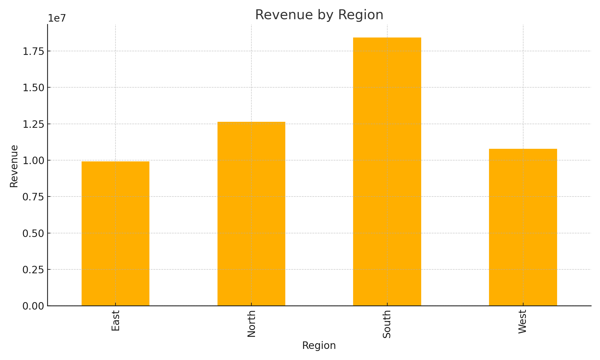

#  **4) sales_insights_dashboard/README.md**

```markdown
#  Sales Insights Dashboard (Retail Analytics)

Dataset with **8,000+ retail transactions** across regions and categories.

---

##  Key Insights
- Revenue by Region  
- Category Performance  
- Profitability Trends  
- Customer Demand Patterns  

---

##  Files
- `sales.csv`
- `analysis_sales.py`
- `revenue_by_region.png`
- `LICENSE.txt`

---

##  Screenshot



## ▶ To Run
```bash
python analysis_sales.py
