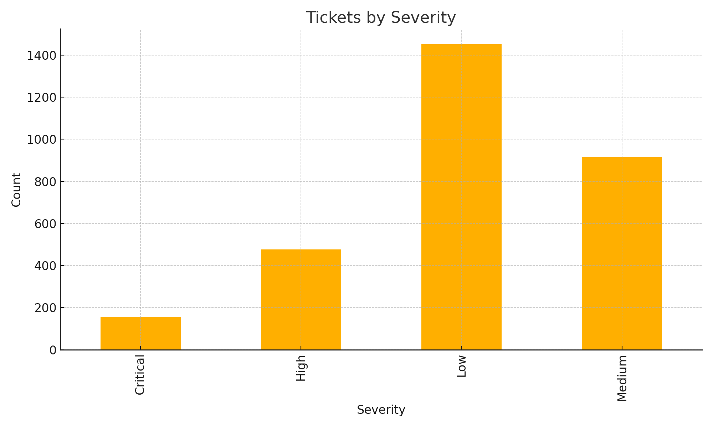

#  **2) service_tickets_dashboard/README.md**

```markdown
# Service Tickets Analytics Dashboard (ITSM)

This project analyzes **3,000+ IT service desk tickets** from categories like Application, Network, Database, etc.

---

##  Key KPIs
- SLA breach %
- Tickets by severity
- Team-wise load distribution
- Resolution time trends

---

##  Files Included
- `tickets.csv`
- `analysis_tickets.py`
- `tickets_by_severity.png`
- `LICENSE.txt`

---

##  Visual Example



---

##  Run Script
```bash
python analysis_tickets.py
